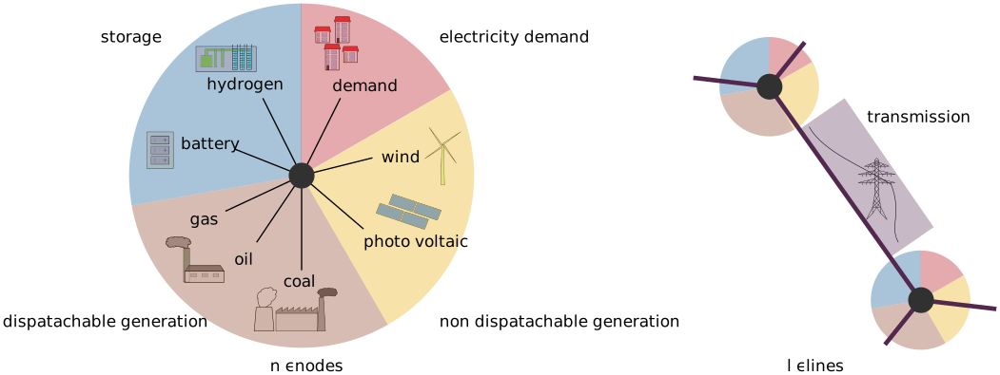

# Capacity Expansion Problem

## General
The capacity expansion problem (CEP) is designed as a linear optimization model. It is implemented in the algebraic modeling language [JUMP](http://www.juliaopt.org/JuMP.jl/latest/). The implementation within JuMP allows to optimize multiple models in parallel and handle the steps from data input to result analysis and diagram export in one open source programming language. The coding of the model enables scalability based on the provided data input, single command based configuration of the setup model, result and configuration collection for further analysis and the opportunity to run design and operation in different optimizations.



The basic idea for the energy system is to have a spacial resolution of the energy system in discrete nodes. Each node has demand, non-dispatchable generation, dispatachable generation and storage capacities of varying technologies connected to itself. The different energy system nodes are interconnected with each other by transmission lines.
The model is designed to minimize social costs by minimizing the following objective function:

```math
min \sum_{account,tech}COST_{account,'EUR/USD',tech} + \sum LL \cdot  cost_{LL} + LE \cdot  cos_{LE}
```

## Variables and Sets
The models scalability is relying on the usage of sets. The elements of the sets are extracted from the input data and scale the different variables. An overview of the sets is provided in the table. Depending on the models configuration the necessary sets are initialized.

| name             | description                                                           |
|------------------|-----------------------------------------------------------------------|
| lines            | transmission lines connecting the nodes                               |
| nodes            | spacial energy system nodes                                           |
| tech             | fossil and renewable generation as well as storage technologies       |
| impact           | impact categories like EUR or USD, CO 2 − eq., ...                    |
| account          | fixed costs for installation and yearly expenses, variable costs      |
| infrastruct      | infrastructure status being either new or existing                    |
| sector           | energy sector like electricity                                        |
| time K           | numeration of the representative periods                              |
| time T           | numeration of the time intervals within a period                      |
| time T e         | numeration of the time steps within a period                          |
| time I           | numeration of the time invervals of the full input data periods       |
| time I e         | numeration of the time steps of the full input data periods           |
| dir transmission | direction of the flow uniform with or opposite to the lines direction |


An overview of the variables used in the CEP is provided in the table:

| name      | dimensions                 | unit                    | description                                                                          |
|-----------|----------------------------|-------------------------|--------------------------------------------------------------------------------------|
| COST      | [account,impact,tech]      | EUR/USD, LCA-categories | Costs                                                                                |
| CAP       | [tech,infrastruct,node]    | MW                      | Capacity                                                                             |
| GEN       | [sector,tech,t,k,node]     | MW                      | Generation                                                                           |
| SLACK     | [sector,t,k,node]          | MW                      | Power gap, not provided by installed CAP                                             |
| LL        | [sector]                   | MWh                     | LoastLoad Generation gap, not provided by installed CAP                              |
| LE        | [impact]                   | LCA-categories          | LoastEmission Amount of emissions that installed CAP crosses the Emission constraint |
| INTRASTOR | [sector, tech,t,k,node]    | MWh                     | Storage level within a period                                                        |
| INTERSTOR | [sector,tech,i,node]       | MWh                     | Storage level between periods of the full time series                                |
| FLOW      | [sector,dir,tech,t,k,line] | MW                      | Flow over transmission line                                                          |
| TRANS     | [tech,infrastruct,lines]   | MW                      | maximum capacity of transmission lines                                               |

## Data
The package provides data [Capacity Expansion Data](@ref) for:

| name   | nodes                                                | lines | years     | tech                                                                         |
|--------|------------------------------------------------------|-------|-----------|------------------------------------------------------------------------------|
| GER_1  | 1 – germany as single node                           | none  | 2006-2016 | Pv, wind, coal, oil, gas, bat_e, bat_in, bat_out, h2_e, h2_in, h2_out, trans |
| GER_18 | 18 – dena-zones within germany                       | 49    | 2015      | Pv, wind, coal, oil, gas, bat_e, bat_in, bat_out, h2_e, h2_in, h2_out, trans |
| CA_1   | 1 - california as single node                        | none  | 2016      | Pv, wind, coal, oil, gas, bat_e, bat_in, bat_out, h2_e, h2_in, h2_out, trans |
| CA_14 ! currently not included ! | 14 – multiple nodes within CA and neighboring states | 46    | 2016      | Pv, wind, coal, oil, gas, bat_e, bat_in, bat_out, h2_e, h2_in, h2_out, trans |
| TX_1   | 1 – single node within Texas                         | none  | 2008      | Pv, wind, coal, nuc, gas, bat_e, bat_in, bat_out                             |

## Opt Types
```@docs
OptDataCEP
OptResult
OptVariable
Scenario
```

## Running the Capacity Expansion Problem

!!! note
    The CEP model can be run with many configurations. The configurations themselves don't mess with each other though the provided input data must fulfill the ability to have e.g. lines in order for transmission to work.

An overview is provided in the following table:

| description                                                                          |  unit            | configuration           | values                                      | type           | default value |
|--------------------------------------------------------------------------------------|------------------|-------------------------|---------------------------------------------|----------------|---------------|
| enforce a CO2-limit                                                                  | kg-CO2-eq./MW    | co2_limit               | >0                                          | ::Number       | Inf           |
| including existing infrastructure (no extra costs)                                   | -                | existing_infrastructure | true or false                               | ::Bool         | false         |
| type of storage implementation                                                       | -                | storage                 | "none", "simple" or "seasonal"              | ::String       | "none"        |
| allowing transmission                                                                | -                | transmission            | true or false                               | ::Bool         | FALSE         |
| fixing design variables and turning capacity expansion problem into dispatch problem | -                | fixed_design_variables  | design variables from design run or nothing | ::OptVariables | nothing       |
| allowing lost load (just necessary if design variables fixed)                        | price/MWh        | lost_el_load_cost       | >1e6                                        | ::Number       | Inf           |
| allowing lost emission (just necessary if design variables fixed)                    | price/kg_CO2-eq. | lost_CO2_emission_cost  | >700                                        | ::Number       | Inf           |

They can be applied in the following way:
```@docs
run_opt
```

### Examples
#### Example with CO2-Limitation
```julia
using ClustForOpt
state="GER_1" #select state
ts_input_data, = load_timeseries_data("CEP", state; K=365, T=24)
cep_data = load_cep_data(state)
ts_clust_data = run_clust(ts_input_data;method="kmeans",representation="centroid",n_init=5,n_clust=5).best_results
solver=CbcSolver() # select solver
# tweak the CO2 level
co2_result = run_opt(ts_clust_data,cep_data;solver=solver,descriptor="co2",co2_limit=500)
co2_result.status
```
#### Example with slack variables included
```julia
slack_result = run_opt(ts_clust_data,cep_data;solver=solver,descriptor="slack",lost_el_load_cost=1e6, lost_CO2_emission_cost=700)
```
#### Example for simple storage
!!! note
    In simple or intradaystorage the storage level is enforced to be the same at the beginning and end of each day. The variable 'INTRASTORAGE' is tracking the storage level within each day of the representative periods.
```julia
simplestor_result = run_opt(ts_clust_data,cep_data;solver=solver,descriptor="simple storage",storage="simple")
```
#### Example for seasonal storage
!!! note
    In seasonalstorage the storage level is enforced to be the same at the beginning and end of the original time-series. The new variable 'INTERSTORAGE' tracks the storage level throughout the days (or periods) of the original time-series. The variable 'INTRASTORAGE' is tracking the storage level within each day of the representative periods.
```julia
seasonalstor_result = run_opt(ts_clust_data,cep_data;solver=solver,descriptor="seasonal storage",storage="seasonal",k_ids=run_clust(ts_input_data;method="kmeans",representation="centroid",n_init=5,n_clust=5).best_ids)
```
## Get Functions
The get functions allow an easy access to the information included in the result.
```@docs
get_cep_variable_set
get_cep_variable_value
get_cep_slack_variables
get_cep_design_variables
```
### Examples
#### Example plotting Capacities

```julia
co2_result = run_opt(ts_clust_data,cep_data;solver=solver,descriptor="co2",co2_limit=500) #hide
using Plots
# use the get variable set in order to get the labels: indicate the variable as "CAP" and the set-number as 1 to receive those set values
variable=co2_result.variables["CAP"]
labels=get_cep_variable_set(variable,1)
# use the get variable value function to recieve the values of CAP[:,:,1]
data=get_cep_variable_value(variable,[:,:,1])
# use the data provided for a simple bar-plot without a legend
bar(data,title="Cap", xticks=(1:length(labels),labels),legend=false)
```
